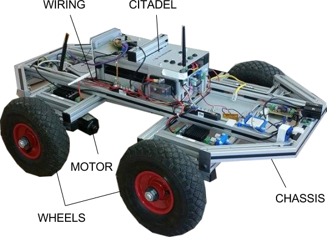

Tiberius - an introduction
==========================

Tiberius is the name of a robotics R&D platform developed by J.T Herd and his Masters students at Heriot-Watt University.

   Tiberius II Development Platform

Development Teams (2005 to Present)
-----------------------------------
The following section lists all known major contributors to the Tiberius project.

2015/16 Development Team
++++++++++++++++++++++++

- Cameron Craig - Control API/Web Interface, IMDB
- Stuart Thain - Navigation Algorithms
- Euan Mutch - Communications, Robotic Arm Design
- Duncan Robertson - Suspension/Steering Design
- Andrew Rigg - Power Management
- Aidan Gallagher - SLAM (Simulataneous Localisation and Mapping)

2014/15 Development Team
++++++++++++++++++++++++

- Sean Cunningham - Power System

- Tasos Deligiannis - Image Processing

- Dionysis Koutavas - Databases/Communication

- Denis Melehovs - Autonomy
