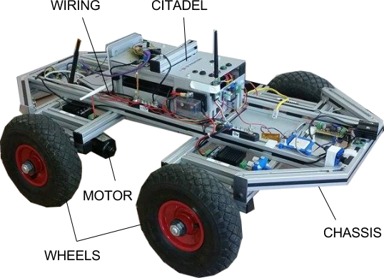

Tiberius - an introduction
==========================

Tiberius is the name of a robotics R&D platform developed by J.T Herd and his Masters students at Heriot-Watt University.

   Tiberius II Development Platform

Development Teams (2005 to Present)
-----------------------------------
The following section lists all known major contributors to the Tiberius project.

2015/16 Development Team
++++++++++++++++++++++++

2014/15 Development Team
++++++++++++++++++++++++

Tasos
Dennis
