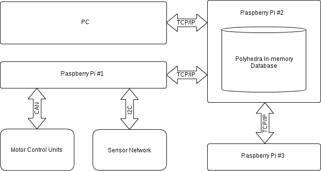

Tiberius's Architecture
==========================

Introduction
------------
ROS (Robot Operating System) is an extremely popular development framework for robots.
The publish-subscribe data model that is used by ROS works wonders, and rightly so no alternative data architecture has aver been considered.
But, how would an alternative architecture compare? This is the question that we ask.
And we hope to get part of the answer by implementing a super-fast in-memory database, and churning through all our data/messages.
This will operate similar to the Blackboard (https://en.wikipedia.org/wiki/Blackboard_(design_pattern)) design pattern.

Our central database architecture will allow any device to access any piece of information,
making it easy to integrate multiple devices, irrespective of the hardware or software it uses.

System Architecture Diagram
---------------------------
The following diagram illustrates an example system utilising our central database architecture:

   Example System Architecture

Our database engine of choice is Polyhedra Lite, the free version of a commercial in-memory database.
Although we have developed a Python wrapper class that creates a common Python interface between any database engine with minimal effort required.

Why not just use ROS?
---------------------

This is a question that we asked ourselves when first presented with the Tiberius project.
Well, you most definitely should use ROS, given the option.
This project is motivated by the research interests of our project supervisor, Jim T. Herd.
However, should you wish to explore a ROS alternative and be willing to to re-write a lot of Python to fit your hardware, then my all means, feel free.
